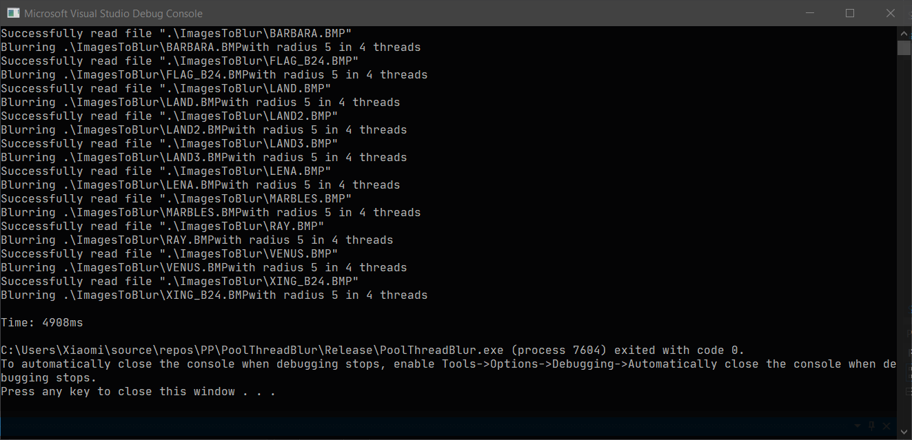

# [Лабораторная работа №*](https://docs.google.com/document/d/14Bj2f2VJitx7qWwcV8GM3qc3khJRY33ZJnUw2Yz_nqg/edit)

## Пул потоков.

### Отчёт

Программы запускались в **Release x64** конфигурации.

#### Thread Mode

#### Pool Mode

#### Выводы

В **pool** режиме видно мелкое, но *стабильное повышение производительности*.

Связано это с тем, что в этом режиме более рационально расходуются ресурсы (для числа картинок бОльшего чем число ядер процессора), т.к. в **thread** режиме все потоки *стартуют одновременно* и *создают задержки друг для друга*, чего не происходит в **pool** режиме.

В **pool** режиме класс `ThreadPool` создаёт n (количество ядер процессора) потоков (**workers**), которые исполняют задачи (**tasks**), заданные в класс с помощью метода `Enqueue`.

T.o. при количестве задач *бОльшем количества процессоров*, **pool** режим будет более предпочтительным, в то время как в обратном случае *будет создавать лишнюю нагрузку* (т.к. **workers** это тоже потоки).
